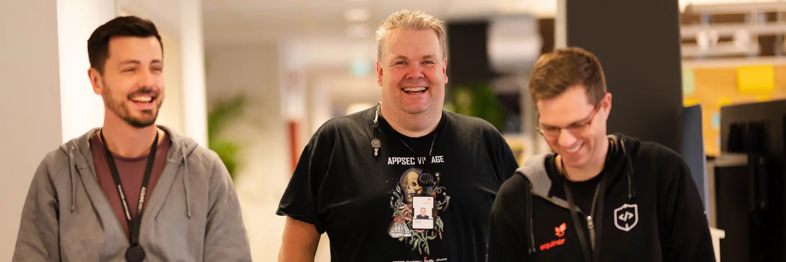
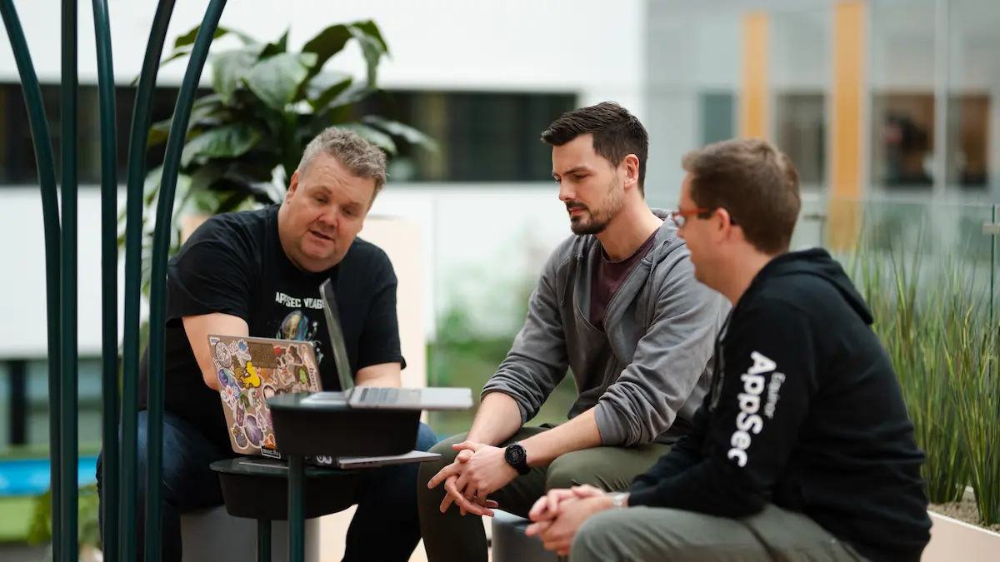
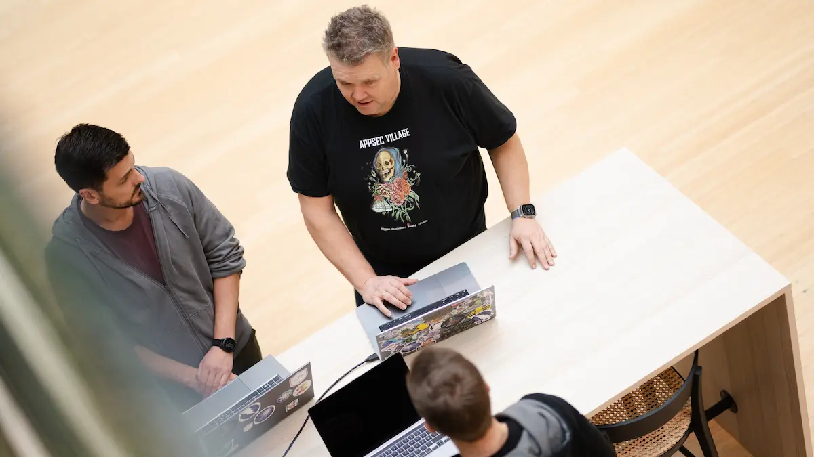
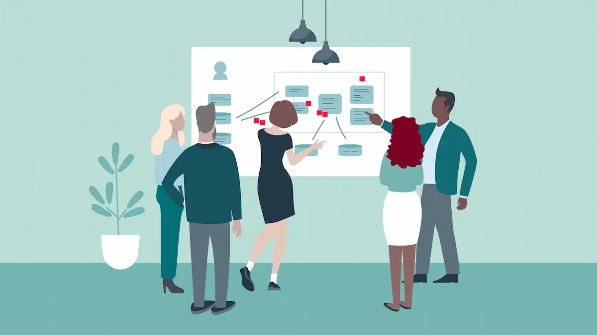

## Championing application security

> How do we build a stronger culture around application security? And how can your team take part in making us more secure? Meet the AppSec team and find out!

Once upon a time, the almighty firewall served as our castle moat. It protected us from any possible threat to our castle walls, or systems and applications if you will, but those days are behind us. Now, we’re headed away from castles and moats and into the cloud.

This means the way we think about security has evolved and requires us to respond.

    

        

    

    

    
        <blockquote> “As we move into the cloud and onto the internet, we become much more exposed, and more of the responsibility to keep us secure falls on our developers. Coupled with >increasingly complex technologies and a heavy cognitive load, we need to build a culture around security to give our teams the tools and mindset they need.”

         - Lars Kåre Skjørestad
    </blockquote>
    

Lars Kåre is part of the Application Security (AppSec) team. He explains that while the goal is to have our development teams be cross-functional and long-lived, we’re still not quite there yet. Now, most of our developer teams are smaller units with a few members. It falls to these very members to handle all aspects of development from frontend to backend – and everything else. As a result, the mindset of “someone else will probably handle security” can take hold.

To avoid just that and make sure our teams have the help they need, the AppSec team was assembled in 2022.

“For us, it’s all about enabling our teams to write more secure code and help them build competence in application security. This means we must understand the context of our teams,” Lars Kåre explains. 

<small>Currently, the AppSec team totals 6 people split between Bergen and Stavanger.</small>

And for Equinor, the context is an important part to understand. We don’t have thousands of developers working on a couple of applications, we have thousands of developers working on hundreds of applications.

“A one-size solution is just not feasible for a context like ours. To make sure that we’re able to maintain secure applications, we need to understand what our teams need and want. We’re here to serve our community of developers and help them develop more secure applications,” Lars Kåre says.

“But ultimately, our goal is that our team won’t be around at all in a couple of years – because security has become such an ingrained part of all our work that we’re no longer needed,” he adds.

So, how do you go about building this culture and making yourself obsolete? Some of the first steps along the way are recruiting security champions, focusing on open source vulnerability management and threat modeling. Let’s find out more!

## Benefit from a collective of knowledge

With so many developers spread across all these teams, you need a direct line to each and every one of them for a culture to truly spread. One way of doing that is by building a network of security champions – people with a keen interest in learning more and championing security in their team.

    

       <blockquote> “Being a security champion doesn’t mean you’re ‘Head of Security’ for your team. It means you’re interested in, want to learn more about security and be someone who champions that work in your team.”

         - Kristian Reed

    

    

            
    
    </blockquote>
    

Just a month into the network’s lifespan they already have more than 140 members, with numbers growing each week. The network officially kicked off with an in-person gathering in Stavanger, where we hosted a Capture the Flag (CTF) competition and community building.

The network also hosts a variety of events; from weekly virtual coffees to monthly seminars on relevant topics. But the heart of everything the network and the AppSec team do is the Slack channel.

“We wanted to create a place where our champions can benefit from the collective knowledge of the entire network and somewhere people could ask for help when they had any questions. Slack was the natural choice to do so,” Kristian says. 

    

        
        <small>In September 2022, the Security Champion Network kicked off</small>

    

    

    
        
        <small>More than 40 Security Champions gathered in Stavanger for the kickoff.</small>

    

Security champion networks are no brand-new concept. NAV, the Norwegian Labor and Welfare Administration, NRK, Telenor, Finn.no and the Norwegian Police all have their own security champions network. There’s also a Norwegian security champions network Slack-community, with participants from a variety of companies, available for anyone who speaks Norwegian.

And all the information on the AppSec GitHub is available to the world – inspired by NAV’s own approach.

“Sharing our knowledge and competence with the world outside of Equinor is just as important as sharing it with our colleagues. If we can help build a community focused around security, we’ll benefit from that in the end,” Kristian says.

    

    <b>The Equinor Security Champion Network</b>
    <ul>
        <li>Grow your security mindset</li>
        <li>Be an advocate of stronger code</li>
        <li>Be an evangelist for security requirements</li>
        <li>Access to exclusive resources and training</li>
        <li>Stay in touch with security teams</li>
    </ul>
    
    <a href="../../../security-champion">Read more</a>
   

    

    

    
        

    

## Understanding how to help

Together with Kristian, Ipsita Mishra also runs the security champion network. Her experience was that people were rarely all that interested in security. Many considered it ‘someone else’s responsibility’, but it was the other way around in Equinor:

    

        

    

    

    
        <blockquote> “A“After we got our first couple of members, the response was overwhelming. We didn’t expect that so many people would be interested in security, nor that they would be so knowledgeable from the start. I think Equinor’s emphasis on safety might have something to do with that.”

         - Ipsita Mishra 
    </blockquote>
    

“What we’ve started with is getting teams to interact, talk about issues, and do it in a constructive way. This hopefully means we can have progress come out of the conversation and put that into action later,” Ipsita explains.

Getting people to come together is no simple task, but it’s one they’ve already made great progress on with the network. The next step is to find out what direction to take it further in - and create a platform where people can learn and get value from together with the rest of the community.

“We’re still a young team, so we’re focusing on trying to understand how we can help people improve their processes and help teams be in a better place. Either through talking to teams and advising them when needed or through introducing people to the tools and software we use," Ipsita explains.

## Automate scanning your code 

The last years, there’s been a solid increase in malicious attacks through third-party dependencies. Just about all Equinor’s software development projects contain open source components and manually keeping up to date on potential security breaches in all of them would be an impossible task. Luckily, Snyk now automates that job.

“Snyk lets us scan all the dependencies in a project for vulnerabilities or malware. Thanks to this, we have an overview of all the possible vulnerabilities in our projects,” Petter Moe Kvalvaag says.

How each team uses the tool in their daily work is up to them to decide, but the most common approach is to tell the tool where your code and GitHub repo is.

    

        

    

    

    
        <blockquote> “Snyk will automatically and continuously scan your code and give you a overview of your status; how many vulnerabilities you have, what they are and what you need to do. Snyk can make a developer's life much easier and can even create pull requests automatically for you.”

         - Petter Moe Kvalvaag
    </blockquote>
    

Together with Ipsita, Petter has been running onboarding sessions and workshops to help spread the word of Snyk to the developer community. They’ also spent time working on a backend solution to Snyk that will help give us even better reporting capabilities.

“Since Snyk itself has limited reporting capabilities, we’ve had to make our own way around it. We’ve used their API, imported vulnerability data into our own database and created visualizations based on this,” Petter explains.

    

        
        <small>Petter works with vulnerability management as part of the AppSec-team.</small>

    

    

    
        
        <small>Benjamin focuses on threat modelling.</small>

    

But why bother with a workaround to visualize data, you might ask? To be able to take an analytical approach and see a bigger picture – of course!

“This could let us see that many different teams are facing the same problem, for example vulnerabilities with Docker Images. We could then help the teams find each other to discuss their problems, but we could also target this issue specifically and provide workshops or training to help solve it. This means we can help the community as a whole,” Petter says.

<blockquote>
“Getting to work with taking an analytical and data-driven approach to the work is really interesting – and very motivating. Not only are we able to find potential problems, but we can also use the data to see if what we did helped or not.”

 - Petter Moe Kvalvaag 
</blockquote>

“Once we have identified an issue and launched an initiative to mitigate it, we're able to see in retrospect how effective our initiative was. This helps us find the most effective way to reach out and assist the teams in the future,” Ipsita explains.

# Why you should prepare for an attack

Knowing what weaknesses you have is one thing, but you should also plan for someone to exploit them right from the start. Welcome to the world of threat modeling. Simply put, it means identifying and discussing the possible threats and weaknesses to your system.

    

       <blockquote> “There are many different methods to do threat modeling, but what they all have in common is that you draw up a diagram of your system. Then, you use this to think of ways that someone could attack your system – and how to prevent or deal with it. You need to think like an attacker to identify your weaknesses. It’s a big cliché but it’s incredibly efficient.”

         - Benjamin Løkling Randeberg 

    

    

            
    
    </blockquote>
    

The team even hosted a threat modeling workshop at EDC 2022, which acts as the foundation for future workshops for threat modeling. So far, they’ve introduced several teams to the concept and are hoping to add even more in the future.

“We’re hosting an in-person workshop, but we’re also following up on the teams in the months after their introduction. This makes sure we can help them with any questions, build upon anything they find and help them become even more secure – based on their team’s context. We really hope threat modeling is something people will adapt, because it’s such a great tool to have,” Benjamin explains.

    

        
        <small>What kind of team would the AppSec team be without their own merch?</small>

    

    

    
        
        <small>What else is there to do when a colleague has a question than to bust out the good old whiteboard?</small>

    

## Learn and consider how things work 

We’ve heard about what the team does, but what is it like to work in the AppSec team? Being part of an enabler team, whose aim is to enable others to be better, can feel quite different from a regular development team.

“Being part of a team that also aims to build a wider culture in the community is new to me, and even though we’re still new it’s really inspiring to see the effect of the work we’re doing,” Petter explains.

Working with security is just like working with technology in general – to keep up you need an eagerness to learn and keep up with what’s new. You also get to understand and explore the bigger picture: 

<blockquote><a style="color:red">
    “Working in security means not only do you get to learn how everything works, but you also get to think about how someone could exploit things. Together, you get an all-round view of what you can do with different things. It’s not just software either, it’s hardware or gadgets too. This combination is what makes it so incredibly interesting. You get to do new things every day and learn new things every day.”

     - Ipsita Mishra
</a></blockquote> 

You’ll get to learn a lot, but you’ll also get to be a teacher in order to spread the good word of application security – for example at internal conferences and workshops. But the gospel of AppSec stretches outside of Equinor as well: Lars Kåre even held a [presentation at Defcon in Las Vegas of 2022](https://www.appsecvillage.com/events/dc-2022/running-system-tests-with-active-authn-z).

“Being part of a team with people who are all so dedicated to and interested in the world of AppSec is really exciting. I get to do what I’m interested in, I get to learn – both on my own and through the team – and the purpose is to make all our teams’ security better,” Benjamin smiles.

As a newly started team, they’re still charting the course for the future.

“We have a lot of freedom to shape the future ourselves and decide the tasks we want to take on. That played a big part in my motivation to join, and still does,” Kristian says.

“And we’re always open to suggestions and are looking to expand the team, so keep an eye out in the future if you would like to join us. Or get in touch directly,” Kristian smiles.

Only time will show if the AppSec team are successful in building a culture around security in our developer community. We’ll be sure to get back to them in a while to get an update on they’re doing.

> Story, text and photographs: Torstein Lund Eik