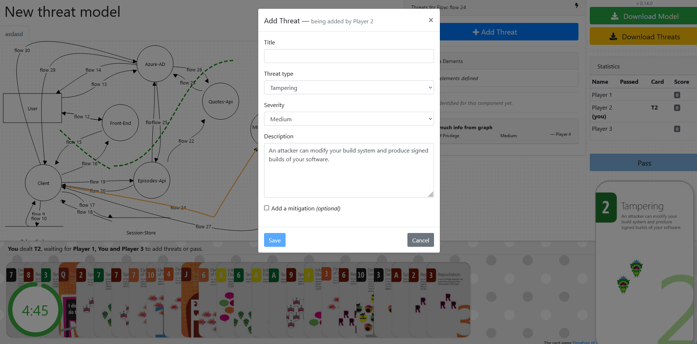

# Gamified Threat Modeling

This gamified method of doing threat modeling might not be for everyone, but it has its pros and is worth testing out.

Here are the pros:  
\+ Depending on your level of geek: Fun!  
\+ Predefined cards with suggested threats - no need to wreck your brain  
\+ Encourages collaboration  
\+ You end up with a JSON that can follow your code  

..and the cons:  
\- Leads to many false positives  
\- Time-consuming  (~2+ h)  
\- Not everyone might find the game-aspect of it as intriguing  
\- Requires a lot more effort than for example doing **[Agile Threat Modeling](./threat_modeling.md)**  
\- Everyone needs a laptop  
\- Requires 3-6 players

### Comments before the How-To

- You need somewhere to host the EoP-game. A tried method is using a dedicated VM in Azure, and running a dockerized-instance of the game.
- Expect a few iteration to get everyone onboard with the game play
- Have a prize for the winner

> __!!! Regardless of how you deploy, be weary of what you information you are exposing through the diagram (IP-addresses, "Equinor", stuff like that)__

### How to:

1. Spin up an instance of *[Elevation of Privilege](https://github.com/dehydr8/elevation-of-privilege)*, reachable to all participants
2. Download (or deploy) an instance of *[OWASP Threat Dragon](https://github.com/OWASP/threat-dragon)*
3. Using OWASP Threat Dragon: Create a diagram of the system in scope
4. Upload the diagram to your EoP-instance, configure a session, distribute the links to participants

Depending on the system in scope, you can choose a suitable card-deck (general vs. a web application)

Game-rules are described **[here](https://logmeincdn.azureedge.net/legal/gdpr-v2/eop-cards-ready-to-print.pdf)**

Afterwards, you can download the model with the added threats and keep it in your code repository.

### Additional resources:
- [A 57-min youtube video describing this method](https://www.youtube.com/watch?v=u2tmLrwv-nc)

