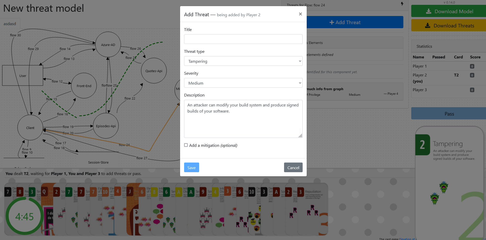

# Threat Modelling

Threat modelling is.. awesome. You will have a hard time investigating Secure Development without this process being mentioned again and again, and it's highly recommended that development teams do this regularly.  

OWASP has a [good overview](https://owasp.org/www-community/Threat_Modeling) of what it's all about, but in short it is a process that helps to identify the threats a system may be exposed to.

## Having Threat Modelling sessions

There are numerous described methods out there for doing threat modelling. One approach that synergizes well with an agile approach to doing development, is [Agile Threat Modelling](https://martinfowler.com/articles/agile-threat-modelling.html). If you integrate this well, this process won't require any extra effort from your normal dev-cycle, but will add great value.  

!!! example "An example of how to get started:"
   
    1. Someone from the team reads and get familiar with [Agile Threat Modelling](https://martinfowler.com/articles/agile-threat-modelling.html)
    2. Choose a scope beforehand (*ex. some upcoming functionality, current functionality, your CI/CD pipeline etc.*)
    3. This person facilitates a threat modelling session with the whole team and other interested parties
    4. Find a way to integrate with your current dev-cycle
        * *as part of existing ceremonies*
        * *as part of detailing a new task*
    

Of course, no shoe fits all. Whichever method you choose, the most important aspect is that it's sustainable and you will be able to continue to do it regularly - and that it gives valuable output.

[PASTA](https://versprite.com/blog/what-is-pasta-threat-modeling/) is also worth noting as a methodology, as it is quite well documented and adopted.

## Alternative forms for doing Threat Modelling

### Abuser stories

When detailing your tasks for upcoming functionality with use cases, consider also writing misuse cases.  

!!! quote "[*ref. OWASP Web Security Testing Guide*](https://owasp.org/www-project-web-security-testing-guide/v42/2-Introduction/README#threat-modeling)"
    Similar to use cases, misuse or abuse cases describe unintended and malicious use scenarios of the application.
    These misuse cases provide a way to describe scenarios of how an attacker could misuse and abuse the application.
    By going through the individual steps in a use scenario and thinking about how it can be maliciously exploited,
    potential flaws or aspects of the application that are not well defined can be discovered. The key is to describe all
    possible or, at least, the most critical use and misuse scenarios  

!!! example
    * As an abuser, I want to gain access to this web application’s Cloud Hosting account so that I can lock out the legitimate owners and delete the servers and their backups, to destroy their entire business.
    * As an abuser, I want to overload this system with requests so that legitimate users won't be able use it

For more information, [read this](https://en.wikipedia.org/wiki/Misuse_case)

### Gamified Threat Modelling

This gamified method of doing threat modelling might not be for everyone, but it has its pros and is worth testing out.

Here are the pros:  
\+ Depending on your level of geek: Fun!  
\+ Predefined cards with suggested threats - no need to wreck your brain  
\+ Encourages collaboration  
\+ You end up with a JSON that can follow your code  

..and the cons:  
\- Leads to many false positives  
\- Time-consuming  (~2+ h)  
\- Not everyone might find the game-aspect of it as intriguing  
\- Requires a lot more effort than for example doing **[Agile Threat Modelling](./threat_modelling.md)**  
\- Everyone needs a laptop  
\- Requires 3-6 players

#### Comments before the How-To

- You need somewhere to host the EoP-game. A tried method is using a dedicated VM in Azure, and running a dockerized-instance of the game.
- Expect a few iteration to get everyone onboard with the game play
- Have a prize for the winner

!!! warning
    Regardless of how you deploy, be weary of what you information you are exposing through the diagram (IP-addresses, "Equinor", stuff like that

!!! info "How to:"

    1. Spin up an instance of *[Elevation of Privilege](https://github.com/dehydr8/elevation-of-privilege)*, reachable to all participants
    2. Download (or deploy) an instance of *[OWASP Threat Dragon](https://github.com/OWASP/threat-dragon)*
    3. Using OWASP Threat Dragon: Create a diagram of the system in scope
    4. Upload the diagram to your EoP-instance, configure a session, distribute the links to participants

Depending on the system in scope, you can choose a suitable card-deck ([general](https://github.com/adamshostack/eop/blob/master/EoP_Card%20Game%20Images.pdf) vs. a [web application](https://owasp.org/www-project-cornucopia/assets/files/Owasp-cornucopia-ecommerce_website-EN.pdf))

Game-rules are described **[here](https://logmeincdn.azureedge.net/legal/gdpr-v2/eop-cards-ready-to-print.pdf)**

Afterwards, you can download the model with the added threats and keep it in your code repository.

#### Additional resources:
- [A 57-min youtube video describing this method](https://www.youtube.com/watch?v=u2tmLrwv-nc)

## Other resources:

* [Equinor AppSec Threat Modelling Slide-deck](https://threatmodeling.app.playground.radix.equinor.com/)
* [Cheat sheet - Sample threats](https://docs.microsoft.com/en-us/previous-versions/msp-n-p/ff649461(v=pandp.10)?redirectedfrom=MSDN)
* [Threat Modelling Manifesto](https://www.threatmodelingmanifesto.org/)
* [OWASPS Threat Modelling Cheat Sheet](https://cheatsheetseries.owasp.org/cheatsheets/Threat_Modeling_Cheat_Sheet.html)