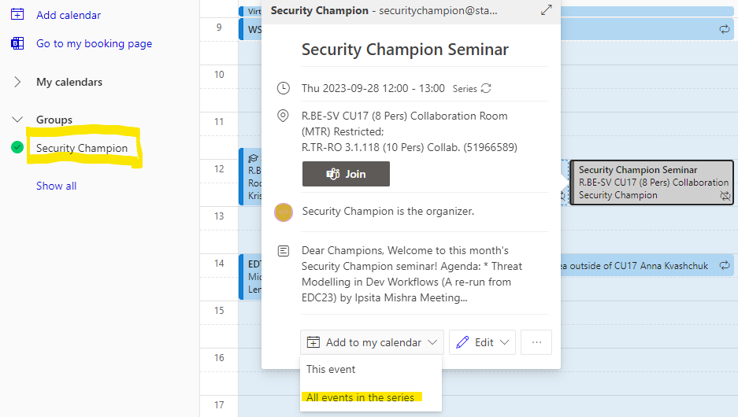

# I've joined, now what?

## Welcome young padawan

This is where the fun begins.

- Join the [#appsec](https://equinor.slack.com/archives/CMM6FSW5V) Slack while you wait for the invitation to the [#security-champion](https://equinor.slack.com/archives/C036HGPBJ04) Slack channel
- Check out what's listed in our [activities](./2-security_champion_activities.md) section
- Check out our [FAQ](./3-faq.md)

!!! question "Here's a puzzle for you :"
    Get your gift by _decoding_ this challenge - <https://forms.microsoft.com/r/cLRPzRtPGQ>

## Add Security Champion events to your calendar

To check all events, and add them to your own calendar, go to your outlook calendar and select the Security Champion Calendar from group calendars:

_Note: This option might not be available on Mac, if that is your case, another option is to use outlook through connectit to add the events._

You can also find a calendar of events on [SharePoint](https://statoilsrm.sharepoint.com/sites/securitychampion9)

## Relevant Slack channels

- [#Security-Champions](https://equinor.slack.com/archives/C036HGPBJ04): Your go-to channel for Security Champion events and information
- [#AppSec](https://equinor.slack.com/archives/CMM6FSW5V): Information regarding AppSec

!!! info
    [#AppSec](https://equinor.slack.com/archives/CMM6FSW5V) Most general information should be posted here so everyone in Equinor has access to it and can participate!

## Relevant events

- Check out the [events section](./events/index.md) for the different events we have going on as well as our past events
