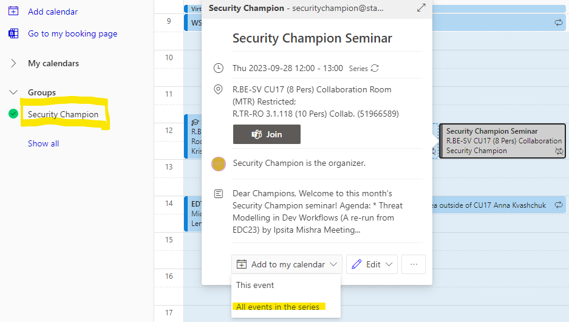

# Events 📣

## Morning coffee :coffee:

Informal chat around application security topics, it's a great place to ask questions and start discussions. It happens every Wednesday from 10:00 to 10:30. You can also propose topics in advace in the [#security-champion](https://equinor.slack.com/archives/C036HGPBJ04) channel on Slack.

## Security Champion Seminar

On the last Thursday of every month, from 12.00 to 13.00, we host the Security Champion Seminar. The seminar typically includes talks from members of the Security Champion network and/or the Application Security team. The agenda of all the past seminars can be found on the [internal Security Champion page](https://statoilsrm.sharepoint.com/sites/securitychampion9/Lists/Security%20Champion%20Seminar/Event%20itinerary%20-%20list%20view.aspx).

### Presenting at the seminar

Do you have any topics you are interested in sharing? Great!😍 Please submit your interest using [this form](https://forms.office.com/r/nVn8BPst42), or get in touch with the `@appsecteam` on [Slack](https://equinor.slack.com/archives/C036HGPBJ04).

## Add Security Champion events to your calendar

To check all events, and add them to your own calendar, go to your outlook calendar and select the Security Champion Calendar from group calendars:

You can also find a calendar of events on [SharePoint](https://statoilsrm.sharepoint.com/sites/securitychampion9).
