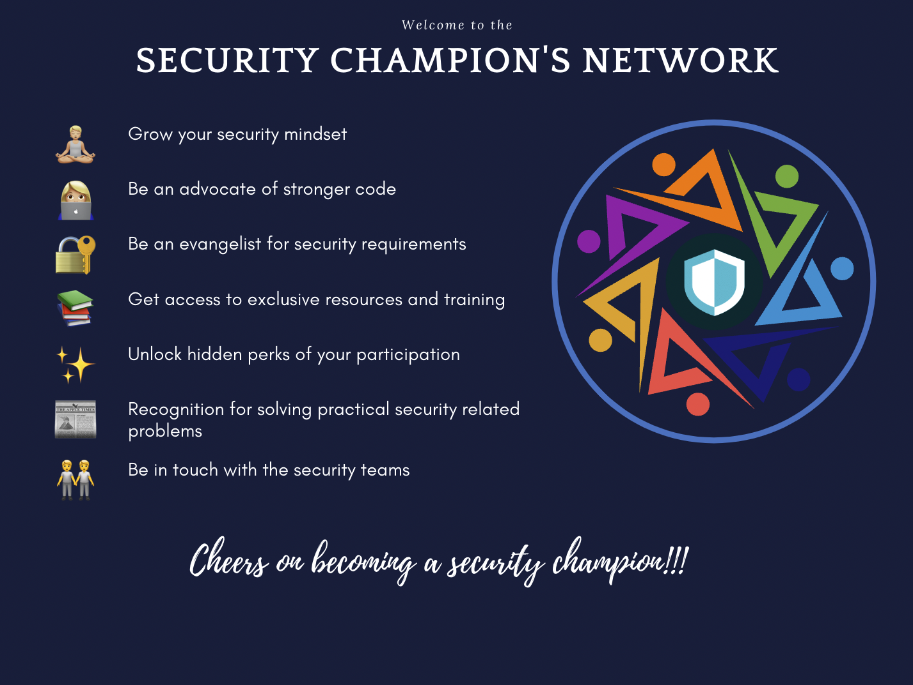

# Welcome

## Say Hello to Others
Join the  [#appsec](https://equinor.slack.com/archives/CMM6FSW5V) and [#security-champion](https://equinor.slack.com/archives/C036HGPBJ04) channels on Slack, and say hello. Avoid missing out on things by turning on notifications for all messages.

!!! question "Here's a puzzle for you :"
    Get your gift by _decoding_ this challenge - <https://forms.microsoft.com/r/cLRPzRtPGQ>

## Reading Material
- Check out some guidelines [here](/appsec/resources/)
- Participate in cool events, conferences and network meetings in the Security Champion's [group calendar]()

## Hands-on Activities
- If your team has not been onboarded to Snyk yet, reach out to the [#appsec](https://equinor.slack.com/archives/CMM6FSW5V) team to have a session organized (you'll learn about your application's security posture)
- If your team is not familiar with or has not done any Threat Modelling yet, reach out to the #appsec  team to have a session organized (it's cool stuff, you'll see)