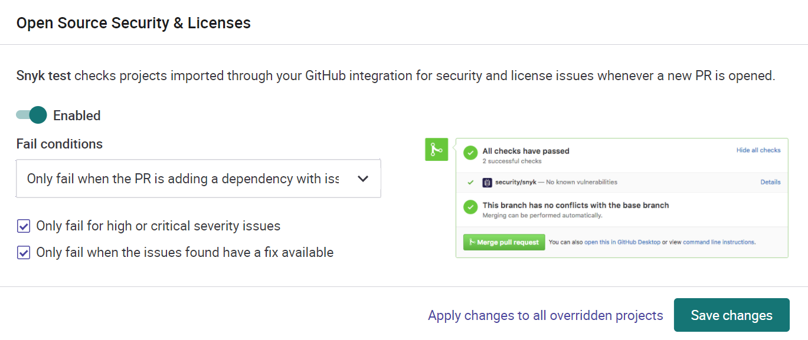
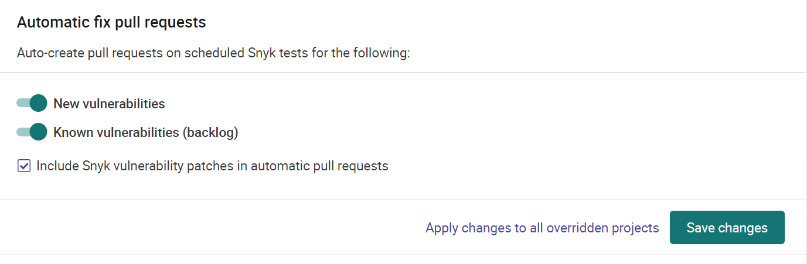

# GitHub integration settings

## Open Source Security & Licenses
It is recommended to enable Snyk test for pull requests. It can be set to either
fail only when the PR adds a new dependency issue, or for all issues. To not overburden
developers with too much information, it is recommended to set this to only fail
when the PR is adding a dependency with issue.

It can also be selected if it should fail for high or critical issues, and only if
there is a fix available. Recommended settings is shown below.

## Automatic fix pull requests
It is recommended to enable Snyk to auto-create pull requests for new and known
vulnerabilities. This will allow Snyk to create a pull request with dependency
upgrade for known issues. If there is no know fix, Snyk also has the possibility
to apply patches to fix the issue. Recommended settings is shown below.

## Automatic dependency upgrade pull requests
Snyk can be used to automatically update dependencies when there is a new patch,
minor or major version available. However we would not recommend enabling this,
since for most projects this will result in a lot of noise from minor upgrades
with no added value. It is instead recommended that the team takes a
proactive role in updating dependencies. For JavaScript projects, the newest
version can be checked with `npm outdated`, and then updated with `npm update`.
For checking vulnerabilities only, `npm audit` can be run get a list of
severities provided by npm. This issues that can be fixed up a package upgrade
can be fixed with `npm audit fix`.

## More information
Read more about how to [read Snyk reports](snyk_reading_reports.md)
