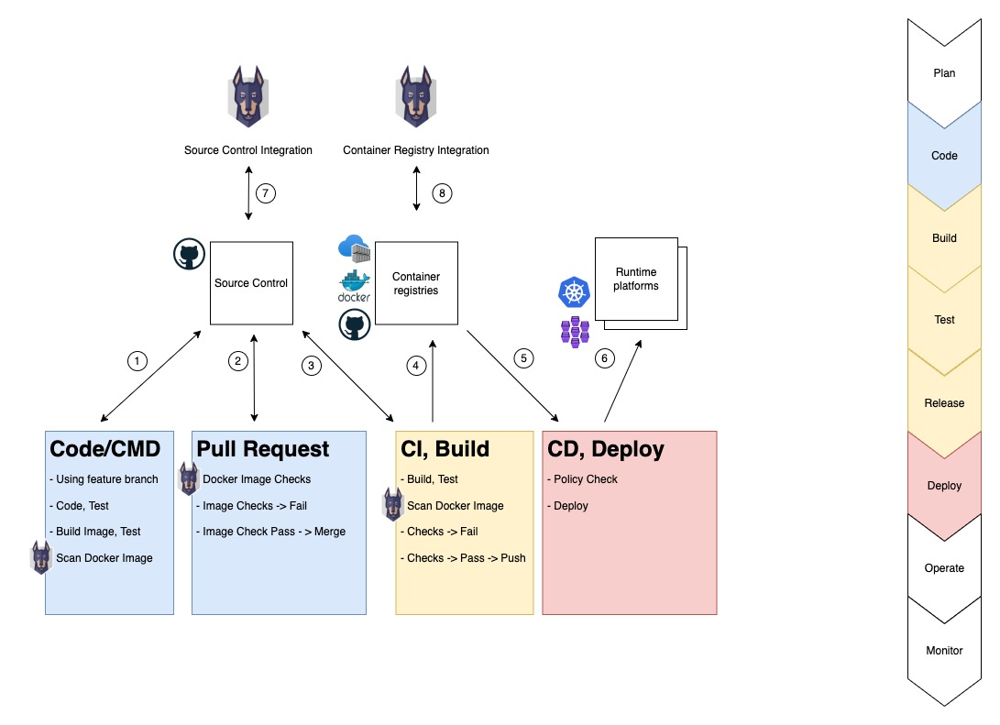

# Container Image Security and Scanning

This guide focuses on security scanning of dependencies used in container images. The guide do not discuss monitoring hosting platforms.

- [Container Image Security and Scanning](#container-image-security-and-scanning)
  - [TL;DR](#tldr)
  - [Snyk in a Software Development Lifecycle](#snyk-in-a-software-development-lifecycle)
  - [Scanning from the Command Line](#scanning-from-the-command-line)
    - [Examples](#examples)
    - [Snyk Config](#snyk-config)
  - [Scanning as part of CI](#scanning-as-part-of-ci)
  - [Monitoring the Container Registries](#monitoring-the-container-registries)
  - [Monitoring the Source Code (SCM)](#monitoring-the-source-code-scm)
  - [View vulnerabilities](#view-vulnerabilities)
  - [Container Image Security](#container-image-security)
  - [Using Snyk behind a PROXY](#using-snyk-behind-a-proxy)
  - [Resources](#resources)
    - [Snyk](#snyk)
    - [Others](#others)

## TL;DR

In your development environment; use [Snyk CLI](https://docs.snyk.io/snyk-cli) to scan local container images and docker files. Use the [Snyk Container Registry](https://docs.snyk.io/products/snyk-container/getting-started-snyk-container) integration to monitor container images and manifests. Configure Snyk's notifications and response to detections. Use the [Snyk Advisor](https://snyk.io/advisor/) when assessing base images (and open source libraries)

## Snyk in a Software Development Lifecycle

Teams have different software development life cycles (SDLC). The following figure illustrate one quite common pattern and could be useful for facilitating discussions.



1) Develop on a feature branch
   - Run tests, build container images, run tests with container images.
   - Use **Snyk Cli** to scan open source dependencies in application (Snyk Open Source)
   - Use **Snyk Cli** to scan container image and manifest (Snyk Container).
2) Create Pull Request (PR) from feature branch
   - Run som automated checks which could include Snyk Open Source and Snyk Container
   - Fail/pass based on own requirements (example: No 'Critical vulnerabilities' with available fix)
3) Merge of PR triggers Continuos Integration (CI)
   - Build artifacts, execute tests
   - Use **Snyk Cli** / **Snyk CI Integration** to scan artifacts (Open Source, Container)
   - Fail/pass based on own requirements (example: No 'Critical vulnerabilities' with available fix)
4) CI passing
   - Push artifacts to package/container registries
5) CD (Continuos Deploy) is triggers
   - Apply policy checks prior to deploying
6) CD - Deploy to hosting platform
7) **Snyk Source Code Monitoring**
   - Scheduled testing of code- and container-manifest (Docker file)
   - Configure Snyk notification and response (PR's etc.)
8) **Snyk Container Registry Integration**
   - Scheduled testing of code image and and container-manifest
   - Configure Snyk notification and response (PR's etc.)

## Scanning from the Command Line

Pre-read; [The Snyk CLI](https://docs.snyk.io/snyk-cli), [Snyk CLI for container security](https://docs.snyk.io/products/snyk-container/snyk-cli-for-container-security), [Snyk CLI reference](https://docs.snyk.io/snyk-cli/cli-reference#options)

Recommendations:

- Include Snyk test as part of your local development process (1)
- Refer to Dockerfile (if available) to have Snyk suggest recommendations for base images
- Use "severity-threshold" to "break builds"

### Examples

Examples assumes the Snyk CLI is installed, that you have authenticated (Both Snyk and Docker) and that you have an image named "isc-quotes-test"

- Scan local container image
  
   ```shell
   snyk container test --file=./Dockerfile isc-quotes-test
   ```

- Scan local container image and application vulnerabilities

   ```shell
   snyk container test --file=./Dockerfile --app-vulns isc-quotes-test
   ```

- Scan remote container image (assuming public image on docker hub)

   ```shell
   snyk container test ubuntu:latest
   ```

- Scan remote container image, only report critical issues (impacts the [exit code](https://docs.snyk.io/snyk-cli/cli-reference#exit-codes))

   ```shell
   snyk container test --insecure --severity-threshold=critical ubuntu:latest
   ```

- Scan local container image user the [docker client](https://docs.docker.com/engine/scan/) (You will have more opportunities to control the scan process using Snyk - options like debug and insecure)
  
   ```shell
   docker scan --file ./Dockerfile isc-quotes-test
   ```

### Snyk Config

   ```shell
   snyk config --help
   ```

- Consider turning off analytics?

## Scanning as part of CI

Snyk has quite a few [CI integrations](https://docs.snyk.io/integrations/ci-cd-integrations). Many of them will use the [The Snyk CLI](https://docs.snyk.io/snyk-cli). You can use the Snyk CLI from *any* CI and get very granular control. When using the Snyk CLI in a CI you would need to provide an [authentication](https://docs.snyk.io/snyk-cli/authenticate-the-cli-with-your-account) token or similar.

Using the [CLI parameters](https://docs.snyk.io/snyk-cli/cli-reference#options-for-multiple-commands) like *--severity-threshold* and *--fail-on* together with [exit codes](https://docs.snyk.io/snyk-cli/cli-reference#exit-codes) will provide a good framework for many scenarios.

The [Advanced Snyk Container CLI](https://docs.snyk.io/products/snyk-container/snyk-cli-for-container-security/advanced-snyk-container-cli-usage) will provide valuable insight and examples.

## Monitoring the Container Registries

Letting Snyk monitor your container images, the ones that are deployed from your registry (or from Docker hub - and others) will provide you notification when vulnerabilities are detected in your base image, for many of the packages you install - as well as for the application you have inside the container.

- Follow the [Getting started with Snyk Container](https://docs.snyk.io/products/snyk-container/getting-started-snyk-container) guide to set-up an integration for your Snyk organization.
  - Add proper credentials
  - Consider enabling "detect application vulnerabilities". Monitoring the application from both the SCM integration and the Container Registry integration may give unexpected noise, duplicate notification etc.
- Add your projects using the Container registration
  - Remember to visit the project settings and tune options like "Docker file" and "Test & Automated Pull Request Frequency" (Connecting the docker file will enable base image recommendations)

## Monitoring the Source Code (SCM)

Snyk can assist in container scanning using the source code as well. This scan will obvious not scan the actual container image, but focus on the source, usually the Dockerfile. This *container scan* is somewhat limited compared to the CLI/Container registry integration.

The SCM integration will scan the Docker file and identify vulnerabilities in the base image. The SCM scan will also provide *base image upgrades* if available.

## View vulnerabilities

For projects, please consult the [Interpreting Snyk Open Source reports](2-snyk_interpret_and_prioritize.md) guideline. Please note the following for containers:

- Review the [base image recommendation](https://docs.snyk.io/products/snyk-container/getting-around-the-snyk-container-ui/base-image-detection#base-image-recommendations) if it exist. Test properly if base image is updated.
- Review the [Image Layer Information](https://docs.snyk.io/products/snyk-container/getting-around-the-snyk-container-ui/image-layer-information) for vulnerabilities to identify where the vulnerability is introduced.
  
## Container Image Security

Snyk provide advice on [Container Security](https://snyk.io/learn/container-security/)

Parts of the conclusion contains the following advice:

- Start with base images from a provider you trust. Use digital signatures to verify authenticity.
- When possible, opt for minimal base images that have only the basic operating system packages, your framework version of choice, and then build up from there.
- Check your images for vulnerabilities early and often.
- Create your own approved base images that are actively maintained and pass all your security checks but scan again as new images get created.
- Scan in multiple places in the software lifecycle: the desktop, in CI, stored images in registries, and the containers / pods actively running in your clusters.

The Docker docs also contain a valuable section on [trusted images](https://docs.docker.com/engine/security/trust/). Docker also has a section on [Best Practices for scanning images](https://docs.docker.com/develop/scan-images/)

## Using Snyk behind a PROXY

Snyk can be used behind a corp proxy but needs proper configuration. Consult the [Snyk Support Document](https://support.snyk.io/hc/en-us/articles/360000925358-How-can-I-use-Snyk-behind-a-proxy-) and an [Equinor Proxy Guide](https://github.com/equinor/protecting-apis-web-apps/blob/main/Support/proxy.md). This is a good and recommended read.

Typical error messages from Snyk CLI with TSL/SSL CA cert issues

- "read ECONNRESET"

Using the debug switch (-d) will provide more insight.

Remember to also configure proxy for the Docker engine. The Snyk Cli will use docker to pull down images before doing the scanning.

## Resources

### Snyk

- [The Snyk CLI](https://docs.snyk.io/snyk-cli)
- [Installing the Snyk CLI](https://docs.snyk.io/snyk-cli/install-the-snyk-cli)
- [Snyk Support](https://support.snyk.io/hc/en-us)
- [Docker Security Scanning Guide 2022](https://snyk.io/learn/docker-security-scanning/)
- [Container security](https://snyk.io/learn/container-security/)
- [Snyk Container](https://docs.snyk.io/products/snyk-container)
- [The Snyk Open Source Advisor](https://snyk.io/advisor/)

### Others

- [CIS Docker Benchmark](https://github.com/dev-sec/cis-docker-benchmark)
- [CNCF - Landscape - Security](https://landscape.cncf.io/card-mode?category=security-compliance&grouping=category)
- [Docker Security](https://docs.docker.com/security/)
- [Docker Scan Images](https://docs.docker.com/develop/scan-images/)
