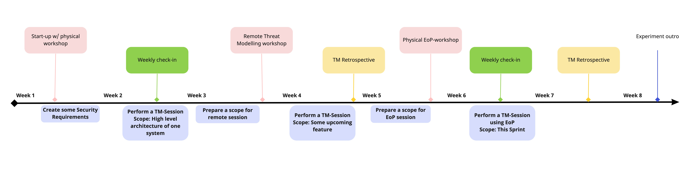

# Next steps

After being introduced to threat modeling, we in the AppSec team would very much like to assist you making this a regular effort in the work you do.

We offer to partner up for a couple of months, building the muscle-memory and finding out where threat modeling fits into your SDLC.

## Expectations to participating teams (2 months perspective)

- 1 full day physical workshop with whole team
- 1 weekly check-in with team
- Team set aside weekly effort for threat modeling
- Key contact is Security Champion

## Expectation to AppSec

- Provide workshop
- Be available 4 hours a week to assist

## A *CRUDE* draft of the two month engagement

