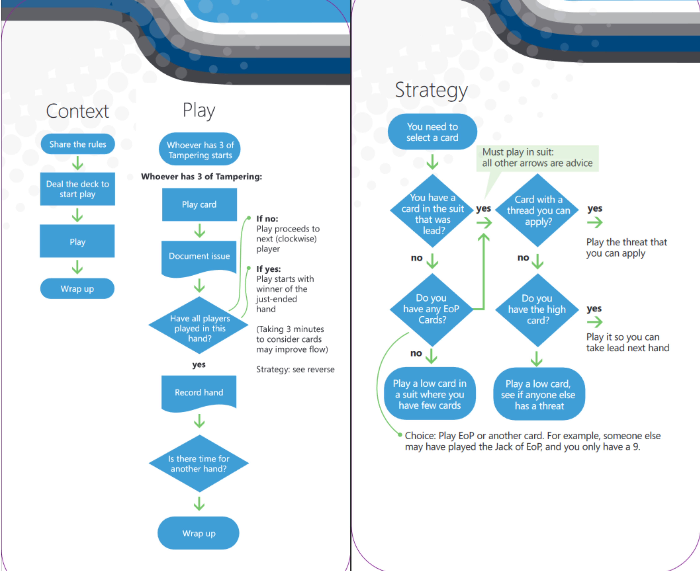

# Extension: Elevation of Privilege game

## About

The Elevation of Privilege (EoP) card game is designed to introduce developers who are not information security practitioners or experts to the craft of threat modeling.

The game consists of 74 playing cards which contain cyber security anti-patterns which supports players as they attempt to find validated security flaws in a system. The cards are in six suits based on the STRIDE mnemonic. The EoP card game was invented by Adam Shostack during his tenure at Microsoft. The game was released in 2010. It is a gorgeously produced design at the centre of a gamification of a security checklist, modelled after the game called Spades.

## How to Play

0. Explain the rules

!!! todo "The rules"
    - 3 of Tampering starts
    - Play clockwise, each player in turn follows the suit if they have a card in that suit
    - If they don't have that suit, they can play another suit.
    - The highest card played wins the round, with "Elevation of Privilege" taking precedence over the suit lead (the suit that started the round).
    - Only "Elevation of Privilege" or the lead suit can win the round.
    ---
    - To play a card, read the card, and try to link it to your diagram. If player manages to link the threat to the diagram, player is awarded a point. If not, the play proceeds.
   
    Points:
    1 for linking a threat, 1 for winning the round

1. Draw a diagram of the system you want to threat model before you deal the cards
2. Deal the deck to 3-6 players.
3. Play until you have depleted the card-deck, or until a player has reached X-number of points

### Variations

- You may pass cards after the third trick. This is
helpful if you have cards that you can’t tie to
the system. Someone else may be able to.
- Double the number of points, and give
one point for threats on other people’s cards.
- Other players may “riff” on the threat and if they
do, they get one point per additional threat.
- Limit riffing to no more than 60 seconds.
- Mark up the diagram with where the threat occurs.

## Resources

- [Download the game as PDF](https://www.microsoft.com/en-us/download/details.aspx?id=20303)
- [Buy the game](https://agilestationery.com/pages/elevation-of-privilege-eop-threat-modeling-card-game)