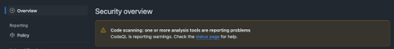
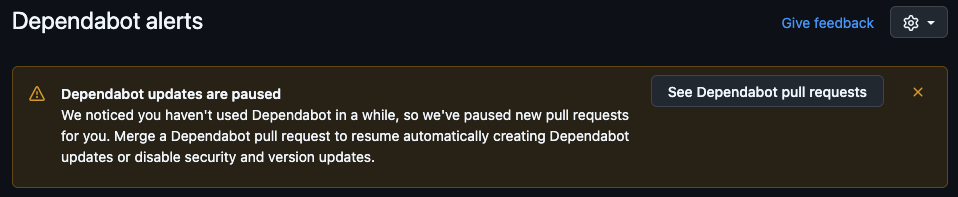

# GitHub Advanced Security (GHAS)

GHAS is now active and available for all repositories.

We have been collecting your questions on GHAS and tried answering them in the [FAQ](faq.md).

Check out [this repository](https://github.com/equinor/appsec-ghas-examples) for our examples on advanced GHAS setups.

!!! note "TL;DR"
    🗓️ GHAS is enabled for all repositories

    🗣️ Let us know in the [#appsec](https://equinor.enterprise.slack.com/archives/CMM6FSW5V) channel if you have any questions

## What this means for you?

**Unified Platform:** Code and code security will now be managed under the same platform, eliminating the need for a separate dashboard.

**Container Scanning**: Please note that GHAS does not currently offer container scanning solutions, we have explored other alternatives like Trivy so please reach out if you have any questions.

**GHAS Features**: We encourage you to enable additional GHAS features like code scanning with CodeQL 

!!! info
    The information that follows offers guidance to internal Equinor teams and might not apply to the broader public.

## Compliance with Governance

To comply with [TR2375](https://docmap.equinor.com/Docmap/page/doc/dmDocIndex.html?DOCKEYID=1000005127) you must perform:

- **SCA** (Software Composition Analysis) - dependency scanning, handled by Dependency Graph.
- **SAST** (Static Application Security Testing) - source code scanning, handled by Code Scanning (CodeQL).

In the Equinor GitHub Organization:

- **Secret Scanning** is enabled by default for all repositories 
- **Dependency Scanning** is enabled by default for most repositories
- **Code Scanning** must be set up manually by a repository Admin

### What do you need to do?

1. Check dependency scanning (SCA)
    In your repository go to Security -> Dependency Scanning and make sure it's active (alerts created)
1. Enable CodeQL (SAST)
    CodeQL is not enabled by default. A repository Admin must:
    - Navigate to Settings → Advanced Security → CodeQL analysis → Set up → Default
    - If the default setup fails, you will see a message under Security → Code Scanning.
      In that case, use an advanced setup. Examples of this are available in the [appsec-ghas-examples repository](https://github.com/equinor/appsec-ghas-examples).

      

!!! warning

    If you ignore your Dependabot alerts for too long, **Dependabot will stop working**.
    In this case, you will see the following warning under Security → Dependabot.

## Exception from Automatic Dependency Submission

Sometimes workflows fail due to automatic dependency submission when Dependabot fails in fetching packages from a private registry:

- First, try following [this guide](https://docs.github.com/en/code-security/dependabot/working-with-dependabot/configuring-access-to-private-registries-for-dependabot#configuring-private-registries)
- If that doesn't solve it, request an exception using [this form](https://forms.cloud.microsoft/e/1Zp1vBiN7Q).

