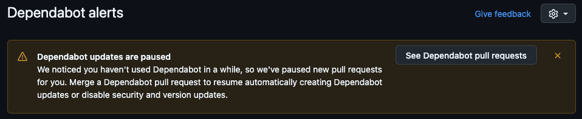

# GitHub Advanced Security (GHAS)

GHAS is now active and available for all repositories.

Check out [this repository](https://github.com/equinor/appsec-ghas-examples) for our examples on advanced GHAS setups.

!!! note "TL;DR"
    🗓️ GHAS is enabled for all repositories

    🗣️ Let us know in the [#appsec](https://equinor.enterprise.slack.com/archives/CMM6FSW5V) channel if you have any questions

## What this means for you?

**Unified Platform:** Code and code security will now be managed under the same platform, eliminating the need for a separate dashboard.

**Container Scanning**: Please note that GHAS does not currently offer container scanning solutions, we have explored other alternatives like Trivy so please reach out if you have any questions.

**GHAS Features**: Core security features are enabled by organization policy. See [Enablement and Setup](setup.md) for the options your team can configure.

!!! info
    The information that follows offers guidance to internal Equinor teams and might not apply to the broader public.

## Compliance with Governance

To comply with [TR2375](https://docmap.equinor.com/Docmap/page/doc/dmDocIndex.html?DOCKEYID=1000005127) you must perform:

- **SCA** (Software Composition Analysis) - dependency scanning, handled by Dependency Graph.
- **SAST** (Static Application Security Testing) - source code scanning, handled by Code Scanning (CodeQL).

In the Equinor GitHub Organization:

- **Secret Protection** is fully enabled by policy and cannot be turned off.
- **CodeQL code scanning** is enabled by policy.
- **Dependency graph and automatic dependency submission** are enabled by policy.
- **Dependabot** is enabled by policy, including alerts and security updates.

### What do you need to do?

Review and address alerts in your repository's **Security** tab. If CodeQL reports a setup or analysis failure, contact the AppSec team in [#appsec](https://equinor.enterprise.slack.com/archives/CMM6FSW5V).

See [Enablement and Setup](setup.md#options-your-team-can-configure) for custom secret patterns, Copilot Autofix, grouped security updates, and Dependabot version updates.

!!! warning

    If you ignore your Dependabot alerts for too long, **Dependabot will stop working**.
    In this case, you will see the following warning under Security → Dependabot.

## Automatic Dependency Submission Issues

Automatic dependency submission is enabled by policy. If it causes problems, such as failures when resolving dependencies from private registries, reach out to the AppSec team in [#appsec on Slack](https://equinor.enterprise.slack.com/archives/CMM6FSW5V).
