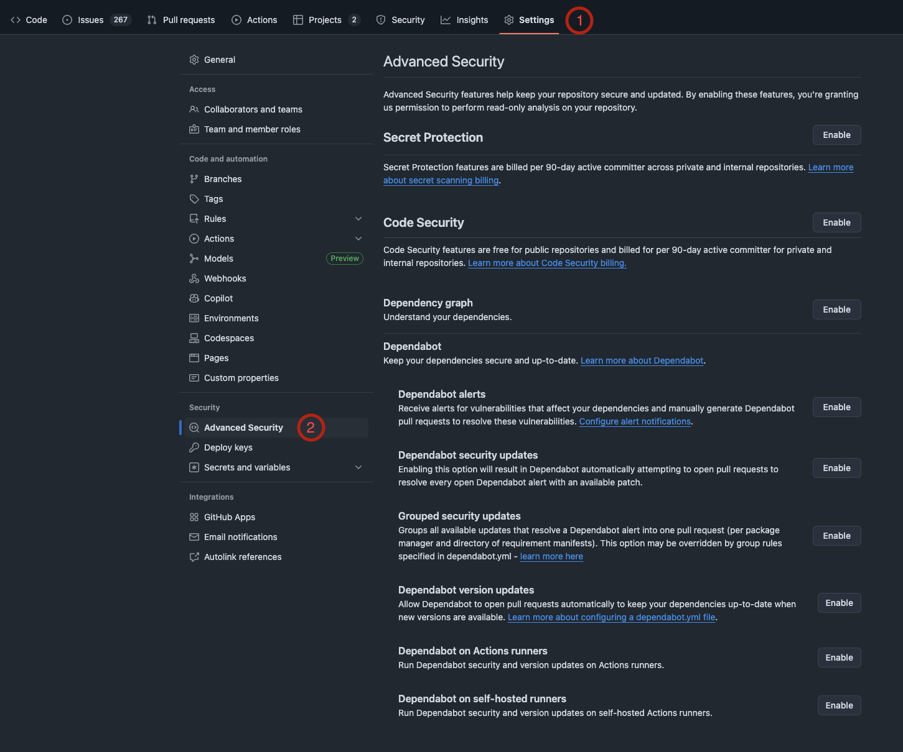
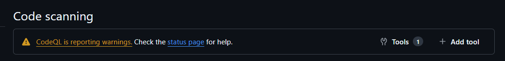
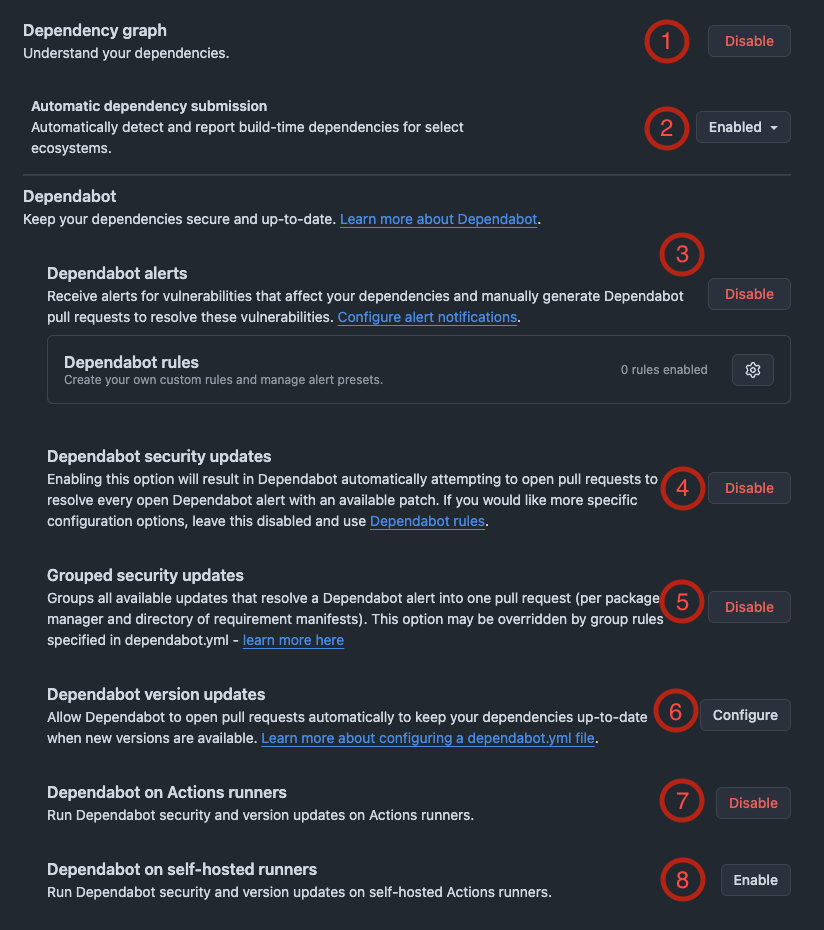

# GitHub Advanced Security Enablement and Setup

>[!IMPORTANT]
>- Internal and Private Repositories must wait until **1st of October** before enabling GHAS.
>  
>- You must be a repository Admin to proceed.

 
This document is intended to give teams an overview of the options available in GitHub Advanced Security (GHAS), including a short summary of each feature, which ones we recommend enabling, which ones we don't and which are up to your team.
  
The document is structured into 3 sections, Secret Protection, Code Security and Dependency Graph, reflecting the structure you will find in Github's security settings.  
To start off, navigate to your repository and under Settings -> Security -> Advanced Security.
  

Below you can find a table summary of the options we recommend to enable:

| **Feature**                                       | **Options**                                                                          | **Recommendation**   |
| ------------------------------------------------- | ------------------------------------------------------------------------------------ | -------------------  |
| [**Secret Protection** (1)](#1-secret-protection) |                                                                                      | ✅ Yes               |
|                                                   | [Validity Checks (2)](#2-validity-checks)                                            | 🤷 Optional          |
|                                                   | [Non-provider Patterns (3)](#3-non-provider-patterns)                                | ✅ Yes               |
|                                                   | [Scan for Generic Passwords (4)](#4-scan-for-generic-passwords)                      | ✅ Yes               |
|                                                   | [Push-Protection (5)](#5-push-protection)                                            | ✅ Yes               |
|                                                   | [Who can bypass push protection (6)](#6-who-can-bypass-push-protection)              | 👤 Anyone (default)  |
|                                                   | [Prevent Alert Dismissal (7)](#7-prevent-alert-dismissal)                            | ❌ No                |
|                                                   | [Custom Patterns (8)](#8-custom-patterns)                                            | 🤷 Optional          |
| [**Code Security** (1)](#1-code-security)         |                                                                                      | ✅ Yes               |
|                                                   | [CodeQL analysis (2)](#2-codeql-analysis)                                            | ⚙️ Default setup     |
|                                                   | [Other tools (3)](#3-other-tools)                                                    | 🤷 Optional          |
|                                                   | [Copilot Autofix (4)](#4-copilot-autofix)                                            | ✅ Yes               |
|                                                   | [Copilot Autofix for Third Party Tools (5)](#5-copilot-autofix-for-third-party-tools)| ✅ Yes               |
|                                                   | [Prevent Direct Alert Dismissal (6)](#6-prevent-direct-alert-dismissal)              | ❌ No                |
|                                                   | [Protection Rules (7)](#7-protection-rules)                                          | ⚙️ Default setup     |
|                                                   | [Private Vulnerability Reporting (8)](#8-private-vulnerability-reporting)            | 🤷 Optional          |
| [**Dependency Graph** (1)](#1-dependency-graph)   |                                                                                      | ✅ Yes               |
|                                                   | [Automatic dependency submission (2)](#2-automatic-dependency-submission)            | ✅ Yes               |
|                                                   | [Dependabot Alerts (3)](#3-dependabot-alerts)                                        | ✅ Yes               |
|                                                   | [Dependabot Security Updates (4)](#4-dependabot-security-updates)                    | ✅ Yes               |
|                                                   | [Grouped Security Updates (5)](#5-grouped-security-updates)                          | 🤷 Optional          |
|                                                   | [Dependabot Version Updates (6)](#6-dependabot-version-updates)                      | 🤷 Optional          |
|                                                   | [Dependabot on Action Runners (7)](#7-dependabot-on-action-runners)                  | ✅ Yes               |
|                                                   | [Dependabot on Self-hosted Runners (8)](#8-dependabot-on-self-hosted-runners)        | ❌ No                |

## [Secret Protection](https://docs.github.com/en/code-security/secret-scanning/introduction/about-secret-scanning)

This section will guide you through the enablement of secret scanning for your repositories.  
It gives a brief explanation of each of the options available and our recommendation on whether to enable them.  
The goal is to detect exposed secrets early on thus reducing risk in the SDLC.  
 

### (1) Secret Protection

Enabling Secret Protection will enable secret scanning on the repository. Upon enabling GitHub will start scanning the whole **history** of the repository for secrets, this scan will include commits, pull requests, issues, comments, discussions and wikis.  
 
✅ Secret Protection should be enabled.

### (2) [Validity checks](https://docs.github.com/en/enterprise-cloud@latest/code-security/secret-scanning/introduction/supported-secret-scanning-patterns#supported-secrets) 

Enhances secret scanning by verifying whether a detected secret is actually valid. When enabled, GitHub forwards the detected secret to the relevant provider (for example, an Azure secret would be sent to Microsoft) to confirm if it's active. Enabling this feature provides teams with insight into whether a secret is live and exploitable. However, it's important to note that the third party may, in the future, automatically revoke or disable the secret once its validity is confirmed. For instance, if Azure confirms a secret is active, it might proactively disable it to prevent abuse.  
 
🤷 The enablement of Validity checks should be decided by the team.

### (3) [Non-provider patterns](https://docs.github.com/en/enterprise-cloud@latest/code-security/secret-scanning/introduction/supported-secret-scanning-patterns#non-provider-patterns)

Improves secret scanning coverage by also detecting secrets that don't belong to a specific provider (like Azure or AWS). This includes things like custom authentication tokens, connection strings, SSH keys, and other credentials.  
 
✅ We recommend enabling Non-provider patterns to catch a broader range of exposed secrets, not just those tied to known providers.

### (4) [Scan for generic passwords](https://docs.github.com/en/enterprise-cloud@latest/code-security/secret-scanning/copilot-secret-scanning/responsible-ai-generic-secrets)

Uses Copilot AI to identify passwords that don’t follow standard or known patterns. This helps catch secrets that might otherwise go undetected—but it can also lead to a slightly higher number of false positives.  
 
✅ We recommend giving Scan for generic passwords a try. If it generates too much noise or becomes disruptive, let us know and feel free to disable it.

### (5) [Push Protection](https://docs.github.com/en/code-security/secret-scanning/introduction/about-push-protection)

Scans commits for [supported secrets](https://docs.github.com/en/enterprise-cloud@latest/code-security/secret-scanning/introduction/supported-secret-scanning-patterns#supported-secrets) and blocks them before they’re pushed to a remote branch. This helps stop secrets from ever reaching the repository history, making cleanup easier or even unnecessary.  
Pushes are only blocked if GitHub is *very confident* that the detected string is a valid secret from a known provider (like Azure, AWS, etc.). It **does not block on non-provider patterns or generic passwords** detected by AI to keep false positives low.  
That said, developers will see push failures when secrets are detected even if they’re false positives, some errors may be a bit hard to figure out and might require digging into logs, so it’s important to prepare your team for this behavior. The alerts can be bypassed (6).  
 
✅ We recommend enabling Push Protection to prevent secrets at the source. But make sure your team is aware of the tradeoff: it may occasionally block a push, but it’s far less painful than cleaning up leaked secrets later.

### (6) [Who can bypass push protection for secret scanning](https://docs.github.com/en/code-security/secret-scanning/using-advanced-secret-scanning-and-push-protection-features/delegated-bypass-for-push-protection/about-delegated-bypass-for-push-protection)

This option is only available when push protection (5) is enabled and it configures who is allowed to bypass the block if a secret is detected. 
 
👤 By default, GitHub allows anyone with write access to bypass the rule and this works well for most teams. If your team prefers tighter control, you can restrict bypass permissions to specific roles or individuals.

### (7) [Prevent direct alert dismissals](https://docs.github.com/en/enterprise-cloud@latest/code-security/secret-scanning/using-advanced-secret-scanning-and-push-protection-features/enabling-delegated-alert-dismissal-for-secret-scanning)

This Setting requires teams to submit a request before they can dismiss a secret scanning alert. These requests must then be reviewed and approved by the AppSec Team. 
 
❌ We do not recommend enabling prevent direct alert dismissals. The AppSec team believes that teams are in the best position to assess alerts in their context and should have the autonomy to manage them.

### (8) [Custom Patterns](https://docs.github.com/en/code-security/secret-scanning/using-advanced-secret-scanning-and-push-protection-features/custom-patterns/defining-custom-patterns-for-secret-scanning)

Lets you define your own regex rules to detect secrets specific to your team or application, things GitHub doesn’t catch by default, this can be useful for internal tokens, credentials, or configuration values that follow a custom format.  
 
🤷 It takes a bit of effort to set up custom patterns, and we don’t expect most teams will need it. But if you think this could be useful for your setup, let us know and we will be happy to help you configure it.

## [Code Security](https://docs.github.com/en/code-security/supply-chain-security/understanding-your-software-supply-chain/about-supply-chain-security)

Code Security manages the configuration of GitHub’s Static Application Security Testing (SAST) tool also known as CodeQL, which runs via GitHub Actions to scan your repository for security issues in the code. 
 

### (1) [Code Security](https://docs.github.com/en/code-security/code-scanning/introduction-to-code-scanning/about-code-scanning)

The setup of CodeQL may vary depending on the language and ecosystem, some will work out of the box, while others may require configuring a workflow file in the repo. Once enabled, it continuously scans code for common vulnerabilities. 
 
✅ Code Security should be enabled.

### (2) [CodeQL Analysis](https://docs.github.com/en/code-security/code-scanning/introduction-to-code-scanning/about-code-scanning-with-codeql)

This has be configured for code security to work. Once enabled a GitHub action will run to scan your code automatically. 
 
⚙️ We recommend choosing the [default setup](https://docs.github.com/en/code-security/code-scanning/enabling-code-scanning/configuring-default-setup-for-code-scanning) for CodeQL Analysis, which works well for most repositories and languages.

> [!WARNING]
> After CodeQL has run for the first time, we recommend you check the Security tab of your repo and then navigate to Code Scanning. 
> If the default setup is not working properly you will see the following warning. Check the [tool status page](https://docs.github.com/en/code-security/code-scanning/managing-your-code-scanning-configuration/about-the-tool-status-page) to get more information about the issue. 
> If you encounter this get in touch with us.

### (3) Other Tools

Enables you to integrate third party code scanning tools such as [Trivy](https://trivy.dev/latest/) for IaC and container scanning.  
 
🤷 If you think setting up other tools would be useful, let us know so we can help you configure it.

### (4) [Copilot Autofix](https://docs.github.com/en/code-security/code-scanning/managing-code-scanning-alerts/responsible-use-autofix-code-scanning)

Allows Copilot to automatically generate a pull request to fix vulnerabilities identified by CodeQL. When enabled, you’ll see suggested fixes, and you can choose to let Copilot create a PR with the proposed changes. 
It’s a helpful way to quickly address straight forward issues but we always recommend to review the fix before merging. 
 
✅ We recommend enabling Copilot Autofix (it does not need a copilot license).

### (5) Copilot Autofix for third-party tools

Copilot Autofix also works with third-party security tools, not just CodeQL. 
 
✅ We recommend enabling Copilot Autofix for third-party tools.

### (6) Prevent direct alert dismissals

If enabled, any attempt to dismiss a CodeQL alert will trigger a review request that’s sent to the AppSec team. This adds unnecessary overhead and delays. We believe teams should be trusted to manage and triage their own alerts based on what makes sense in their context. 
 
❌ We do not recommend enabling prevent direct alert dismissals setting.

### (7) Protection rules

Allows you to set a check runs failure threshold to control when code scanning should block a pull request.
You can choose the alert severity level that will cause the Code Scanning check to fail. Combined with a branch ruleset, this allows you to prevent merges to protected branches when these severity level issues are detected. 
 
⚙️ The recommended set up of protection rules should be good for most teams, let us know if you need help setting up a more advanced ruleset.

### (8) [Private vulnerability reporting](https://docs.github.com/en/code-security/security-advisories/guidance-on-reporting-and-writing-information-about-vulnerabilities/privately-reporting-a-security-vulnerability)

This is only available for public repositories, it provides a standardized and secure way for the community to report security vulnerabilities directly to the maintainers of the repository. 
 
🤷 Enablement of private vulnerability reporting should be a team decision, consider how you plan to respond to incoming reports if enabled.

## [Dependency Graph](https://docs.github.com/en/code-security/supply-chain-security/understanding-your-software-supply-chain/about-the-dependency-graph)

The Dependency Graph gives GitHub visibility into the dependencies used in your repository. 
This is the foundation for the features below, enabling GitHub to identify known vulnerabilities or outdated packages in your project. 
Dependabot helps ensure your supply chain is monitored for risks and helps you in keeping your dependencies secure and up to date.

### (1) Dependency Graph

Must be enabled to use Dependabot, this allows GitHub to upload your dependencies and scan them for known vulnerabilities
For this to work, your repository must include a lock or manifest file. [In some ecosystems](https://docs.github.com/en/code-security/supply-chain-security/understanding-your-software-supply-chain/dependency-graph-supported-package-ecosystems), like .NET, Java and Jupyter Notebooks you may need to run a dotnet restore (more guidance on this will come) to generate the required files. 
 
✅ Dependency Graph should be enabled.

### (2) [Automatic dependency submission](https://docs.github.com/en/enterprise-cloud@latest/code-security/supply-chain-security/understanding-your-software-supply-chain/configuring-automatic-dependency-submission-for-your-repository)

This allows GitHub to detect and report dependencies automatically. It helps keep your Dependency Graph up to date without manual intervention. 
 
✅ Automatic dependency submission should be enabled with the default settings.

### (3) [Dependabot alerts](https://docs.github.com/en/code-security/dependabot/dependabot-alerts/about-dependabot-alerts)

Notify you when vulnerabilities are found in your dependencies. Alerts will appear in the GitHub UI under the Security Dashboard, and can also be sent by email and filtered to a seperate folder (e.g. by using the "security" keyword). 

>[!Note]
>Slack notifications are not available with GHAS. We recommend setting up email notifications or configuring GitHub notification rules to make sure your team stays up to date on security issues.

✅ We recommend enabling Dependabot alerts.

### (4) [Dependabot security updates](https://docs.github.com/en/code-security/dependabot/dependabot-security-updates/about-dependabot-security-updates)

This will automatically create pull requests to upgrade dependencies to safe, non-vulnerable versions. 
 
✅ We recommend enabling Dependabot security updates.

### (5) [Grouped security updates](https://docs.github.com/en/code-security/dependabot/dependabot-security-updates/about-dependabot-security-updates#about-grouped-security-updates)

This option allows Dependabot to combine multiple security updates into a single pull request. This helps reduce the number or PRs but might require more thorough testing to ensure the combined upgrades do not break existing functionality. 
 
🤷 The enablement of Grouped security updates is up to the team.

### (6) [Dependabot version updates](https://docs.github.com/en/code-security/dependabot/dependabot-version-updates/about-dependabot-version-updates)

Allows Dependabot to open pull requests to keep your dependencies up to date, even if there are no known vulnerabilities. This helps reduce technical debt and makes it easier to stay updated to the latest versions. 
 
🤷 The enablement of Dependabot version updates is up to the team.

### (7) [Dependabot on action runners](https://docs.github.com/en/code-security/dependabot/working-with-dependabot/about-dependabot-on-github-actions-runners)

Enabling this option will result in Dependabot being run on an action runner, making it more transparent what Dependabot does. GitHub is moving to run by default on Action runners. 
 
✅ We recommend enabling Dependabot on action runners.

### (8) [Dependabot on self-hosted runners](https://docs.github.com/en/code-security/dependabot/maintain-dependencies/managing-dependabot-on-self-hosted-runners)

Enables Dependabot to run on a self-hosted action runner. 
 
❌ For most teams we do not recommend enabling Dependabot on self-hosted runners, but let us know if you think it could be useful for your team.

## Further Questions & Comments

We encourage you to share your experiences, issues and improvement points with us. 
If you have any futher questions or comments please reach out to us on the [#appsec](https://equinor.enterprise.slack.com/archives/CMM6FSW5V) slack.
