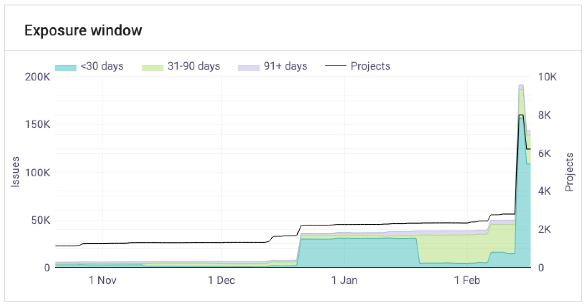

>Focus on the issues that pose the greatest risk.

The default reports in Snyk does not provide a lot of information. However, the reports at hand should be used as the measures is rather important and give insight on where the team can use their effort to reduce vulnerability risks. The `Reports` are available from the top menu in Snyk (screenshot below).

## Exposure window

Main objective for developers should be to close the window of opportunity for attackers. In Snyk reports, this is presented as a `Exposure window` - graph. Exposure window measures the time between discovery of a vulnerability and mitigation of the vulnerability in the developers repositories.

The graph presents how long the exposure is : `< 30 days`, `31 - 90 days` and `91+ days`, meaning for how long has the vulnerability been exposed in the developers project and thus represented an opportunity for an attacker.

Recommendation is to reduce the exposure window as low as possible. The developer focus should be to monitor this frequently and lower the opportunity for attackers to a minimum - aka less than 30 days. A high number of issues exposed for a longer time, increases the exposure and possibility for compromise of the project. This is as valid for development and test code, as for production ready code. It's very common to use developer devices and privileges in our on-prem network, thus reducing exposure window in developer and test environments, is as important as production environments.

If the team's projects have high volume of issues in the graph representing `91+ days`, it indicates unhealthy practices on mitigating dependency vulnerabilities.

## Security issues

Security issues summaries issues on criticality from `Critical` to `Low severity`. (Example screenshot below)

The developers should not be complacent with a high number of `auto fixable` issues in the critical or high severity category. These are issues which Snyk propose a fix for by accepting a proposed pull request and thus does not impact to much of a of developers time.

(For understanding severity - please read, ['How to interpret and prioritize Snyk findings'](./snyk_reading_reports.md) guideline.)
