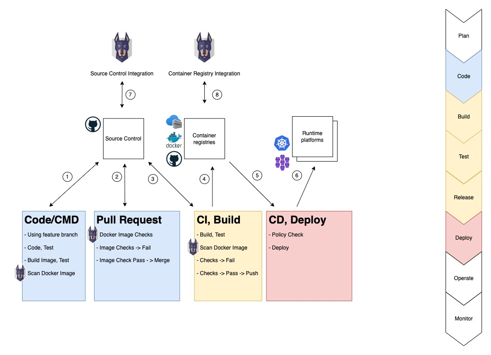

# Container Image Security & Scanning

This guide focuses on security scanning of dependencies used in container images. The guide does not discuss monitoring hosting platforms.

**TL;DR**

In your development environment; use [Snyk CLI](https://docs.snyk.io/snyk-cli) to scan local container images and docker files. Use the [Snyk Container Registry](https://docs.snyk.io/products/snyk-container/getting-started-snyk-container) integration to monitor container images and manifests. Configure Snyk's notifications and response to detections.

## Snyk in a Software Development Lifecycle

Teams have different software development life cycles (SDLC). The following figure illustrate one quite common pattern and could be useful for facilitating discussions.



1) Develop on a feature branch
   * Run tests, build container images, run tests with container images.
   * Use **Snyk Cli** to scan open source dependencies in application (Snyk Open Source)
   * Use **Snyk Cli** to scan container image and manifest (Snyk Container).
2) Create Pull Request (PR) from feature branch
   * Run som automated checks which could include Snyk Open Source and Snyk Container
   * Fail/pass based on own requirements (example: No 'Critical Vulns' with available fix)
3) Merge of PR triggers Continuos Integration (CI)
   * Build artifacts, execute tests
   * Use **Snyk Cli** / **Snyk CI Integration** to scan artifacts (Open Source, Container)
   * Fail/pass based on own requirements (example: No 'Critical Vulns' with available fix)
4) CI passing
   * Push artifacts to package/container registries
5) CD (Continuos Deploy) is triggers
   * Apply policy checks prior to deploying
6) CD - Deploy to hosting platform
7) **Snyk Source Code Monitoring**
   * Scheduled testing of code- and container-manifest (Docker file)
   * Configure Snyk notification and response (PR's etc.)
8) **Snyk Container Registry Integration**
   * Scheduled testing of code image and and container-manifest
   * Configure Snyk notification and response (PR's etc.)

## Scanning from the Command Line

Pre-read; [The Snyk CLI](https://docs.snyk.io/snyk-cli), [Snyk CLI for container security](https://docs.snyk.io/products/snyk-container/snyk-cli-for-container-security), [Snyk CLI reference](https://docs.snyk.io/snyk-cli/cli-reference#options)

Recommendations:

* Include Snyk test as part of your local development process (1)
* Refer to Dockerfile (if available) to have Snyk suggest recommendations for base images
* Use "severity-threshold" to "break builds"

### Examples

Examples assumes the Snyk CLI is installed, that you have authenticated (Both Snyk and Docker) and that you have an image named "isc-quotes-test"

* Scan local container image
  
   ```shell
   snyk container test --file=./Dockerfile isc-quotes-test
   ```

* Scan local container image and application vulnerabilities

   ```shell
   snyk container test --file=./Dockerfile --app-vulns isc-quotes-test
   ```

* Scan remote container image (assuming public image on docker hub)

   ```shell
   snyk container test ubuntu:latest
   ```

* Scan remote container image, only report critical issues (impacts the [exit code](https://docs.snyk.io/snyk-cli/cli-reference#exit-codes))

   ```shell
   snyk container test --insecure --severity-threshold=critical ubuntu:latest
   ```

* Scan local container image user the [docker client](https://docs.docker.com/engine/scan/) (You will have more opportunities to control the scan process using Snyk - options like debug and insecure)
  
   ```shell
   docker scan --file ./Dockerfile isc-quotes-test
   ```


### Snyk Config

   ```shell
   snyk config --help
   ```

* Consider turning off analytics?

## Scanning as part of CI

* Use Cli
* Use CI integrations
* Break - pass the CI

## Monitoring the Container Registries

* Configure the integration

## Monitoring the Source Code (SCM)

* Configure the integration. Recommend?
* Remember container scanning can also scan for app vulns

## Container Image Security

* General advice on container image security

## Resources

* [The Snyk CLI](https://docs.snyk.io/snyk-cli)
* [Installing the Snyk CLI](https://docs.snyk.io/snyk-cli/install-the-snyk-cli)
* [Snyk Support](https://support.snyk.io/hc/en-us)

* CIS Docker Benchmark (https://github.com/dev-sec/cis-docker-benchmark)?
* Container security - https://snyk.io/learn/container-security/
* Snyk Container - https://docs.snyk.io/products/snyk-container
* CNCF - Landscape - Security - https://landscape.cncf.io/card-mode?category=security-compliance&grouping=category
* Docker Security - https://docs.docker.com/security/
* Docker Scan Images - https://docs.docker.com/develop/scan-images/

## Using Snyk behind a PROXY

Snyk can be used behind a corp proxy but needs proper configuration. Consult the [Snyk Support Document](https://support.snyk.io/hc/en-us/articles/360000925358-How-can-I-use-Snyk-behind-a-proxy-) and an [Equinor Proxy Guide](https://github.com/equinor/protecting-apis-web-apps/blob/main/Support/proxy.md)

Typical error messages from Snyk CLI with TSL/SSL CA cert issues
- "read ECONNRESET"

Using the debug switch (-d) will provide more insight.

Remember to also configure proxy for the Docker engine. The Snyk Cli will use docker to pull down images before doing the scanning