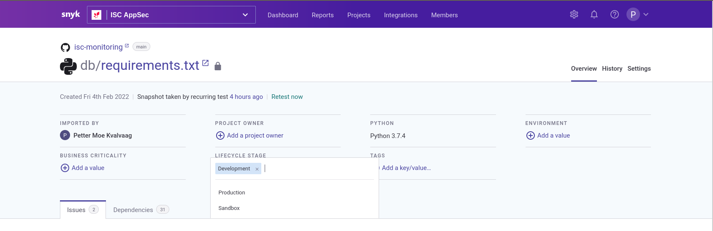

# Introduction
## What is it
Snyk is a bundle of tools which helps managing vulnerabilities throughout the software development lifecycle. Currently Equinor has
licenses for Snyk Open Source and Snyk Container which helps manage vulnerabilities related to third party software either as dependencies
or as part of the base docker images your app depends on.

## Third party dependencies
All modern IT projects today pull in volumes of code from open source projects. It is not possible to read and understand this code,
and as such this becomes a legitimate application security risk. An example is the recent supply chain attack through [`colors.js`](https://snyk.io/blog/open-source-npm-packages-colors-faker/), where the maintainer simply added an infinite loop in the code resulting
in a Denial of Service to any Node.js server using it.

This is a strong argument for pinning packages to exact versions as provisioned in e.g. npm lock files, but the counter side of that
is that you need to explicitly upgrade to get the latest security patches. Given the complexity of this landscape, using
automated tools quickly becomes a requirement to keep software patched and secure.

So what can we do to mitigate this risk? The current strategy in Equinor is to automatically scan the projects using tools like Snyk.
These tools can scan code repositories continuously and on every pull request. They will find your Dockerfiles, npm package-locks,
pip requirements and many other packaging formats and check if you are currently installing a dependency with an associated
known vulnerability. They will also assist you in assessing the severity and suggesting mitigating actions.

# Getting started
Snyk is available to all teams who code in Equinor. First, apply for Snyk in [AccessIT](https://accessit.equinor.com/Search/Search?term=snyk), then ask [#sdpteam](https://equinor.slack.com/archives/C02JJGV05) to create a Snyk organization for your team.

When you have been granted an organization, make sure to log on to [snyk sso](https://app.snyk.io/login/sso) and use your Equinor
email address. Here you can start integrating Snyk with the code you are working with.

## Creating projects
Snyk has many different kinds of integrations, we recommend starting with adding your github repositories. Doing that will create
one snyk project for each source file it understands, e.g. `requirements.txt` or `package-lock.json`. More about github integration
can be found [here](gh-integration.md)

## Project attributes
To be able to do searching, filtering and aggregation of Snyk data, it is highly recommended that you set some attributes on all
projects. Especially the `Lifecycle stage` should be set to an appropriate value, and then `Business criticality` and `Environment`
fields can be set as needed. For more flexible tagging the `Tags` field can be used but it is recommended to be used with care as 
free-form tags can be difficult to maintain.

## Privacy
Concerns about which data snyk collects are addressed on Snyk's [privacy policy page](https://snyk.io/policies/privacy/)

## Learn more

* [Integrate with github](gh-integration.md)
* [Read Snyk reports](snyk_reading_reports.md)
* [Interpret and prioritize findings](snyk_interpret_and_prioritize.md)
* [Official documentation](https://docs.snyk.io/)
* [Snyk API documentation](https://snyk.docs.apiary.io/)

