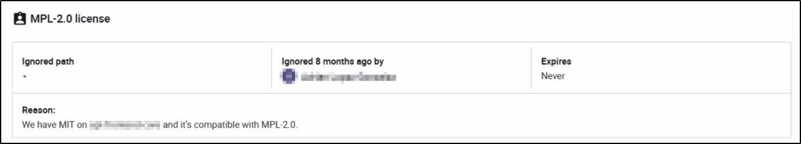
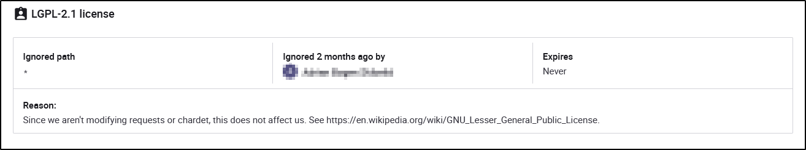

# Interpreting issues regarding licenses  

## Intro

> !!!!! To enable the rule-set that alerts on potential issues, add the "Distributed" environment-tag in your projects. __If you cant see 'Distributed' in the list, try searching for it__

Open source software you use in your projects (eg. libraries) are licensed by the author(s) to ensure that it is used the way the author attended. There are many different licenses out there. Some of them are created to ensure the freedom of use without asking anything in return. Others may require that projects using the licensed software adopt the same license and make their software open and free.

[**Information on why/how Snyk reports on License-issues**](https://docs.snyk.io/products/snyk-open-source/licenses)

*The subject of license-issues is **most** relevant for Equinor's Open Source Software projects, as obligations to comply is usually triggered by distribution.*  

From the [**OSLC-handbook**](https://github.com/finos/OSLC-handbook/blob/master/output/adoc/OSLC-handbook.adoc):

> **Distribution is defined as:**  
> *providing software to another entity, i.e., an individual or organization outside your company or organization.*

> Determining the requirements that need to be met to comply with open source licenses involves the following:
>
> 1. You must know what open source software you are using;
> 2. You must know what license applies to that open source software and the relevant legal interpretation of the license; and
> 3. You must know how you using that open source software.

## What to do

We recommend that all teams, regardless of whether they are *distributing* their solutions or not, acquire a working knowledge of the subject of Open Source Licenses.  

You should act when Snyk report on license issues. This will involve investigating the terms of the license in question, and to do the necessary steps to comply.  

Sometimes in order to stay compliant, one might have to adopt a new license for your software, replace the open source software, or in some cases ignore it because you find out you are not under obligation to comply.

## *Example*

This Equinor team maintains an application used by Equinor employees. The source-code is not made available, and the application is only reachable from the internal network.

Snyk report the following issue:

Investigating the AGPL-3.0 license, looking into the resources linked to at the bottom of this guide, the investigator finds the following useful information:

> As any distribution of software that is linked to or incorporates AGPL components triggers copyleft, either the entire product must be made available under the AGPL **or the product must only be used strictly internally.**

Since this is the case for their application, they do not trigger the copyleft clause, and this issue can be resolved without further action.

What they do next is described bellow.

## What to do after an issue is resolved

After a license-issue is resolved, a good practice would be to document it in Snyk via the 'ignore' button.

If you do need assistance, don't be afraid to reach out on [Slack](https://equinor.slack.com/archives/CMM6FSW5V)

## More information

Some useful resources are listed bellow:

* [Snyk Learn - Open Source Licenses](https://snyk.io/learn/open-source-licenses/)

* [IT Professional Network in Equinor's guidelines on choosing an open source license for your project](https://github.com/equinor/it-professional-network/blob/master/doc/open_source/licenses.md)

* [Open Source Licenses Explained](https://www.whitesourcesoftware.com/resources/blog/open-source-licenses-explained/)

* [Open Source License Compliance Handbook](https://github.com/finos/OSLC-handbook/blob/master/output/adoc/OSLC-handbook.adoc)  

* [Open Source and Copyleft - How to ensure commercially accepted use](https://www.schjodt.no/en/news--events/newsletters/open-source--copyleft-licenses-how-to-ensure-commercially-acceptable-use/)

Some examples of compliance failures:

* [Common Open Source License Compliance Failures](https://www.linux.com/news/4-common-open-source-license-compliance-failures-and-how-avoid-them/)
* [Common Open Source IP Compliance Failures](https://www.linux.com/news/3-common-open-source-ip-compliance-failures-and-how-avoid-them/)
 

